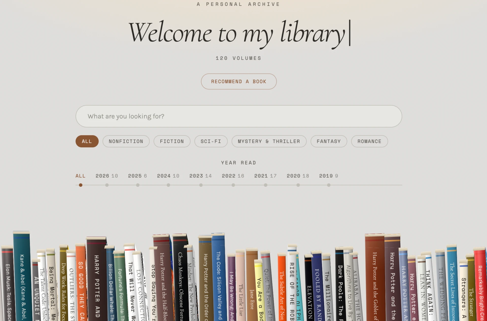

# Celia's Virtual Library

Turn my Goodreads into an interactive library.



A 3D bookshelf built from a Goodreads export — hover a spine to peek at a book, click to pull it out, and browse everything you've read (or plan to read) with plain-English search, genre filters, and a year-read timeline.

## Features

- **3D shelves** — 120 read/currently-reading books plus a "Still to read" shelf, with physical props (width, lean, wear) derived from each book's page count
- **Book detail** — click any spine to pull the book out and flip it open, with cover, blurb and rating; navigate with ←/→
- **Plain-English search** — AI-powered search across titles, authors, years and blurbs
- **Filters** — genre pills and a year-read timeline
- **Recommend a book** — anyone can add a book to a "Recommended to me" shelf via Open Library

## Development

```sh
git clone <this-repository-url>
cd <repository-name>
npm i
npm run dev
```

## Built with

- TanStack Start
- TypeScript
- React
- Tailwind CSS
